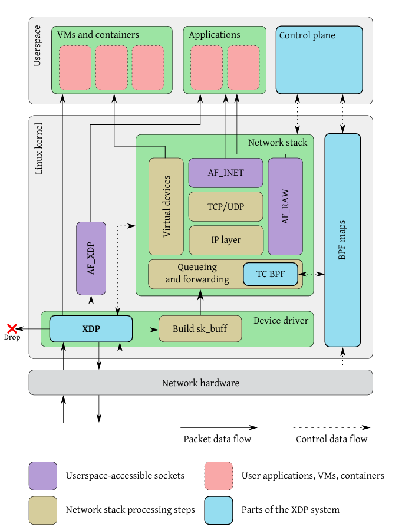

# 05/05/2025

[Recursive MakeConsidered Harmful](https://www.cse.iitd.ac.in/~sbansal/csp301/auug97.pdf)

### Key Points


### Sourcing a file.

When a script is sourced (using the . or source command), it inherits the positional parameters ($@, $1, $2, etc.) that were available in the calling shell's environment at the time of the sourcing. This means the sourced script can access and use these arguments as if they were passed directly to it. 

```sh
. auto/configure 

source auto/options 
```

[Nginx build system](https://github.com/nginx/nginx/blob/master/auto/configure)

#### Cool Tricks

1. heredoc

```bash

$ cat << END
> $0: This will write until 
> you see an .........
> END
-bash: This will write until
you see an .........
```

Here END is a delimitter


```
Nginx Reference /auto/have file.

# Copyright (C) Igor Sysoev
# Copyright (C) Nginx, Inc.


cat << END >> $NGX_AUTO_CONFIG_H

#ifndef $have
#define $have  1
#endif

END

```

# 08/05/2025

[The Slab Allocator:
 An Object-Caching Kernel Memory Allocator](https://srl.cs.jhu.edu/courses/600.418/SlabAllocator.pdf)

 1. Slab Allocator Deep dive week, one of my teammates implemented a slab allocator and that led to me reading their code 
    and also see how slab allocators work in linux.
1.  [Chapter 8 Slab Allocator](https://www.kernel.org/doc/gorman/html/understand/understand011.html)

### Object Caching

```c
#include <stdio.h>
#include <stdlib.h>
#include <string.h>
#include <time.h>

#define ITERATIONS 1000

typedef struct {
    int id;
    char name[256];
    double values[128];
} MyStruct;

int main() {
    clock_t start, end;
    double time_malloc_free, time_memset_reuse;

    // ==== CASE 1: malloc + free each time ====
    start = clock();
    for (int i = 0; i < ITERATIONS; ++i) {
        MyStruct *obj = (MyStruct *)malloc(sizeof(MyStruct));
        if (!obj) {
            fprintf(stderr, "malloc failed\n");
            return 1;
        }
        obj->id = i;  // Simulate some usage
        free(obj);
    }
    end = clock();
    time_malloc_free = ((double)(end - start)) / CLOCKS_PER_SEC;
    printf("Time with malloc + free each time: %f seconds\n", time_malloc_free);

    // ==== CASE 2: allocate once, reuse with memset ====
    MyStruct *obj = (MyStruct *)malloc(sizeof(MyStruct));
    if (!obj) {
        fprintf(stderr, "malloc failed\n");
        return 1;
    }

    start = clock();
    for (int i = 0; i < ITERATIONS; ++i) {
        memset(obj, 0, sizeof(MyStruct));  // Reset fields
        obj->id = i;  // Simulate some usage
    }
    end = clock();
    time_memset_reuse = ((double)(end - start)) / CLOCKS_PER_SEC;
    printf("Time with single malloc + memset reuse: %f seconds\n", time_memset_reuse);

    free(obj);
    return 0;
}
```

```
Time with malloc + free each time: 0.000226 seconds
Time with single malloc + memset reuse: 0.000046 seconds
```

### Slab Allocator Implementation


-> Unix Internals The new frontiers - Uresh Vahalia

Notice the freelist pointer at the end of every block.
```c
// Get the address of the freelist linkage stored at the end of the buffer
static inline void** get_freelist_linkage(void* buffer) {
    return (void**)((uint8_t*)buffer + BUFFER_SIZE - sizeof(void*));
}
```


## 10/05/2025

Per CPU Slab Allocator (In Progress)

[Extending the Slab Allocator to Many CPUs and Arbitrary Resources](https://github.com/tpn/pdfs/blob/master/Magazines%20and%20Vmem-%20Extending%20the%20Slab%20Allocator%20to%20Many%20CPUs%20and%20Arbitrary%20Resources.pdf)

## 17/05/2025

One of our teams presented the new LB which uses XDP as its core.
[xDP](https://raw.githubusercontent.com/tohojo/xdp-paper/master/xdp-the-express-data-path.pdf)


1. While XDP allows packet processing to move into the operating
 system for maximum performance, it also allows the programs
 loaded into the kernel to selectively redirect packets to a special
 user-space socket type, which bypasses the normal networking
 stack, and can even operate in a zero-copy mode to further lower
 the overhead.

 

 1. The infrastructure to execute the program is contained in the kernel as a library function,
    which means that the program is executed directly in the device driver, without context
    switching to userspace. (Green box)

 1. The program is executed at the earliest possible moment after a packet is received from
    the hardware, before the kernel allocates its per-packet sk_buff data
    structure or performs any parsing of the packet.

 1. After parsing the packet data, the XDP program can use the
 context object to read metadata fields associated with the packet,
 describing the interface and receive queue the packet came from, 

 1. The context object also gives access to a special memory area,
 located adjacent in memory to the packet data. The XDP program
 can use this memory to attach its own metadata to the packet,
 which will be carried with it as it traverses the system.

 1. ALso make use of persistent bpf maps.
 
 1. Can do any transformation on the packet.

 ```
 [Network Hardware]
        │
        ▼
[NIC receives packet]
        │
        ▼
[Hardware IRQ or NAPI polling]
        │
        ▼
[NIC Driver (in Kernel)]
        │
        ├── XDP Program Attached to thc NIC?
        │       │
        │       ├── Yes ─► [Run eBPF XDP Program (in kernel)]
        │       │             │
        │       │             ├── XDP_DROP  ──► Drop packet (early exit)
        │       │             ├── XDP_TX    ──► Send back out same NIC
        │       │             ├── XDP_REDIRECT ─► Send to other interface or CPU
        │       │             └── XDP_PASS  ──► Continue normal processing
        │       │
        │       └── No ──────► Continue
        │
        ▼
[Allocate sk_buff (socket buffer)]
        │
        ▼
[Pass sk_buff to Kernel Networking Stack]
        │
        ├── Netfilter / iptables
        ├── IP layer
        ├── TCP/UDP
        └── Socket receive queue
        ▼
[Userspace reads packet via recv()/poll() etc.]
 ```