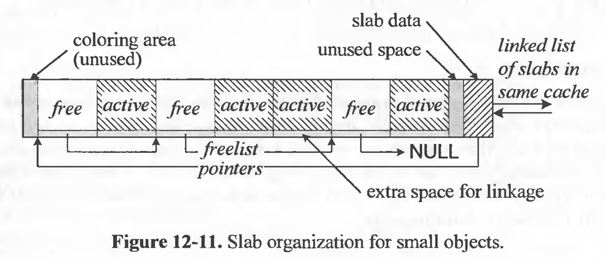
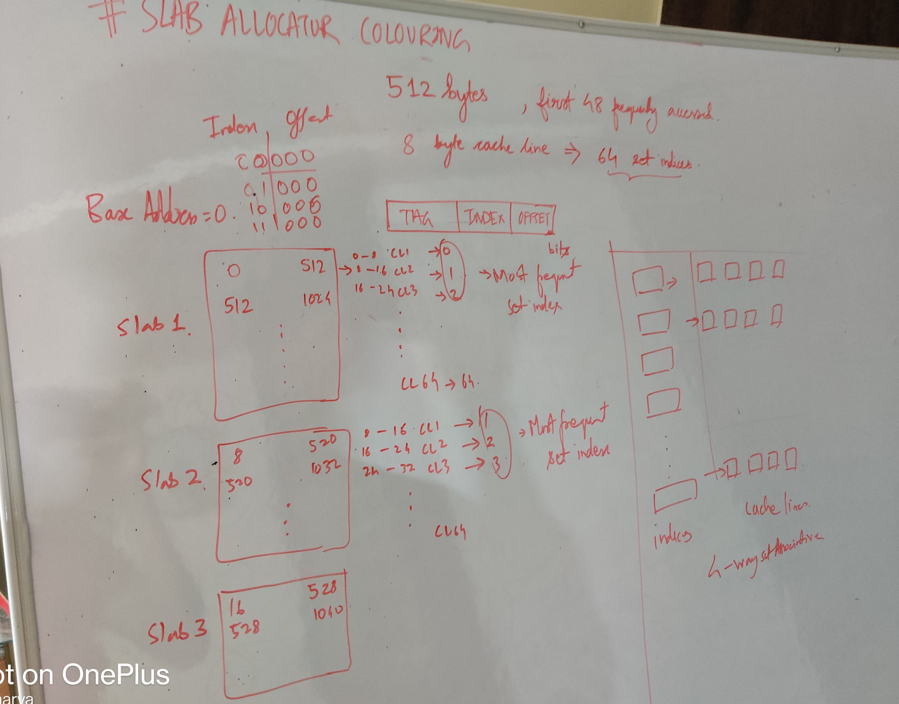

# 05/05/2025

[Recursive MakeConsidered Harmful](https://www.cse.iitd.ac.in/~sbansal/csp301/auug97.pdf)

### Key Points


### Sourcing a file.

When a script is sourced (using the . or source command), it inherits the positional parameters ($@, $1, $2, etc.) that were available in the calling shell's environment at the time of the sourcing. This means the sourced script can access and use these arguments as if they were passed directly to it. 

```sh
. auto/configure 

source auto/options 
```

[Nginx build system](https://github.com/nginx/nginx/blob/master/auto/configure)

#### Cool Tricks

1. heredoc

```bash

$ cat << END
> $0: This will write until 
> you see an .........
> END
-bash: This will write until
you see an .........
```

Here END is a delimitter


```
Nginx Reference /auto/have file.

# Copyright (C) Igor Sysoev
# Copyright (C) Nginx, Inc.


cat << END >> $NGX_AUTO_CONFIG_H

#ifndef $have
#define $have  1
#endif

END

```

# 08/05/2025

[The Slab Allocator:
 An Object-Caching Kernel Memory Allocator](https://srl.cs.jhu.edu/courses/600.418/SlabAllocator.pdf)

 1. Slab Allocator Deep dive week, one of my teammates implemented a slab allocator and that led to me reading their code 
    and also see how slab allocators work in linux.
1.  [Chapter 8 Slab Allocator](https://www.kernel.org/doc/gorman/html/understand/understand011.html)

### Object Caching

```c
#include <stdio.h>
#include <stdlib.h>
#include <string.h>
#include <time.h>

#define ITERATIONS 1000

typedef struct {
    int id;
    char name[256];
    double values[128];
} MyStruct;

int main() {
    clock_t start, end;
    double time_malloc_free, time_memset_reuse;

    // ==== CASE 1: malloc + free each time ====
    start = clock();
    for (int i = 0; i < ITERATIONS; ++i) {
        MyStruct *obj = (MyStruct *)malloc(sizeof(MyStruct));
        if (!obj) {
            fprintf(stderr, "malloc failed\n");
            return 1;
        }
        obj->id = i;  // Simulate some usage
        free(obj);
    }
    end = clock();
    time_malloc_free = ((double)(end - start)) / CLOCKS_PER_SEC;
    printf("Time with malloc + free each time: %f seconds\n", time_malloc_free);

    // ==== CASE 2: allocate once, reuse with memset ====
    MyStruct *obj = (MyStruct *)malloc(sizeof(MyStruct));
    if (!obj) {
        fprintf(stderr, "malloc failed\n");
        return 1;
    }

    start = clock();
    for (int i = 0; i < ITERATIONS; ++i) {
        memset(obj, 0, sizeof(MyStruct));  // Reset fields
        obj->id = i;  // Simulate some usage
    }
    end = clock();
    time_memset_reuse = ((double)(end - start)) / CLOCKS_PER_SEC;
    printf("Time with single malloc + memset reuse: %f seconds\n", time_memset_reuse);

    free(obj);
    return 0;
}
```

```
Time with malloc + free each time: 0.000226 seconds
Time with single malloc + memset reuse: 0.000046 seconds
```

### Slab Allocator Implementation


-> Unix Internals The new frontiers - Uresh Vahalia

Notice the freelist pointer at the end of every block.
```c
// Get the address of the freelist linkage stored at the end of the buffer
static inline void** get_freelist_linkage(void* buffer) {
    return (void**)((uint8_t*)buffer + BUFFER_SIZE - sizeof(void*));
}
```


